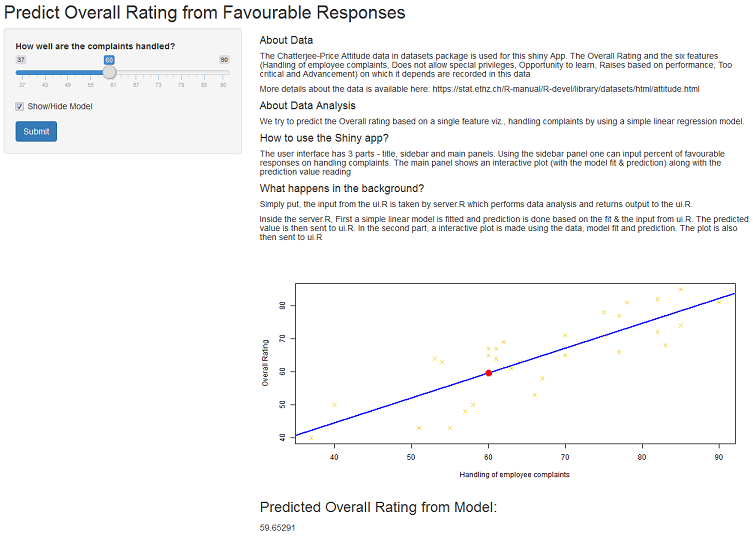

## Introduction

<font size="3">
**About the Data** 

The Chatterjee-Price Attitude data in datasets package is used for this shiny App.

The Overall Rating and the six features (Handling of employee complaints, Does not allow special privileges, Opportunity to learn, Raises based on performance, Too critical and Advancement) on which it depends are recorded in this data. 

More details about the data is available here: 
https://stat.ethz.ch/R-manual/R-devel/library/datasets/html/attitude.html

We try to predict the Overall rating based on a single feature viz., handling 
complaints by using a simple linear regression. 

**About the Shiny App**

The user inputs the value for the feature : Handling of employee complaints. 

The input is recorded to predict the overall rating using a simple linear 
regression model fit. 

The output is displayed in the plot and also as a reading. 
</font>

## Embedded Shiny App

```{r app2, echo=FALSE}
library(shiny)
shinyApp(
        
     ui=fluidPage(
        titlePanel("Predict Overall Rating from Favourable Responses"),
        sidebarLayout(
                sidebarPanel(
                        sliderInput("sliderComp", "How well are the 
                                    complaints handled?", 37, 90, 
                                    value = 60),
                        checkboxInput("showModel", "Show/Hide Model", 
                                      value = TRUE),
                        submitButton("Submit") 
                            ),
                mainPanel(
                        plotOutput("plot"),
                        h3("Predicted Overall Rating from Model:"),
                        textOutput("pred")
                        )
                     )
                ),

server = function(input, output) {
        modelFit <- lm(rating ~ complaints, data = attitude)
        
        modelPred <- reactive({
                compInput <- input$sliderComp
                predict(modelFit, 
                        newdata = data.frame(complaints = compInput))
        })

        output$pred <- renderText({
                modelPred()
        })
        
        output$plot <- renderPlot({
                compInput <- input$sliderComp
                plot(x=attitude$complaints, y=attitude$rating, 
                     xlab = "Handling of employee complaints", 
                     ylab = "Overall Rating", 
                     bty = "o", pch = 4, col="gold2",
                     xlim = c(37, 90), ylim = c(40, 85))
                if(input$showModel){
                        abline(modelFit, col = "blue", lwd = 2)
                }
                points(compInput, modelPred(), col = "red", 
                       pch = 16, cex = 2)
        })
        
}, 

options = list(height = 500)
)
```

## Snap of shiny app



## Conclusion: 

From the values of input and respective calculated output values it is observed that the Overall rating is very much closer in value to the feature Handling of complaints.


